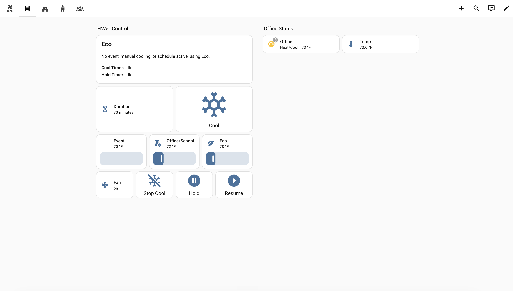
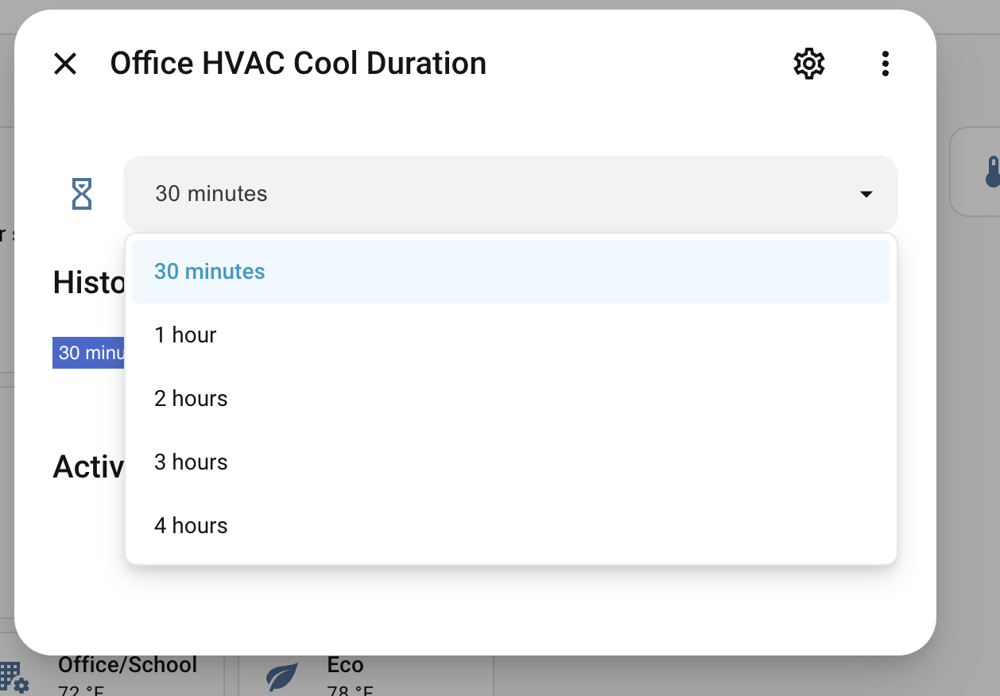

# Example Dashboard

The automation does not require a custom dashboard, but a small control page makes it much easier to understand what the HVAC manager is doing.

The screenshots below are from a real Home Assistant dashboard using this pattern:

## What To Show

A useful HVAC dashboard should answer four questions quickly:

- What mode is this zone in right now?
- Why is it in that mode?
- What are the current thermostat readings?
- What temporary override controls are available?

Recommended cards:

- Effective mode and reason helpers.
- Thermostat tile or climate status card.
- Room temperature sensor.
- Manual cool duration selector.
- Manual cool, stop cool, hold, and resume buttons.
- Event, office/school, and eco setpoint controls.
- Fan mode control.

## Example YAML

See [`examples/dashboard/office-hvac-dashboard.yaml`](../examples/dashboard/office-hvac-dashboard.yaml).

That file is intentionally simple and uses mostly standard Home Assistant cards. You will need to rename entity IDs to match your own helpers, scripts, and thermostats.

The manual cool buttons reference example scripts such as `script.office_hvac_start_manual_cool`. If your setup does not use those scripts, remove those buttons or point them at your own override scripts.

## Keep It Safe

For shared buildings, avoid hiding important HVAC state behind one big button. Show the mode and reason next to the controls so staff can tell whether the automation is following a calendar event, office/school hours, an override, or Eco fallback.
